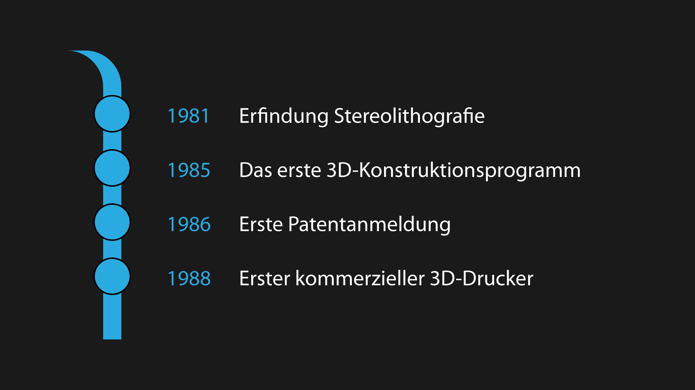
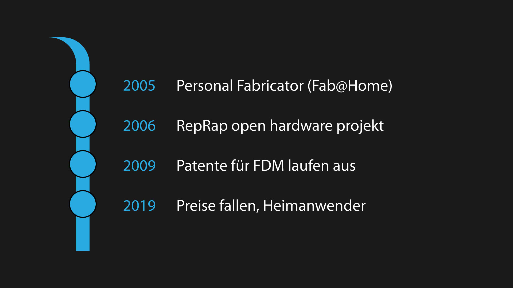
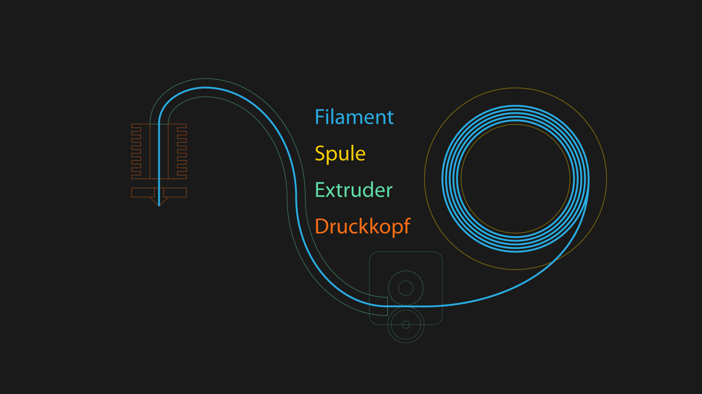
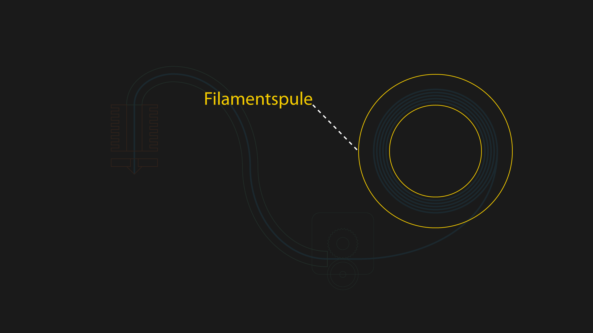
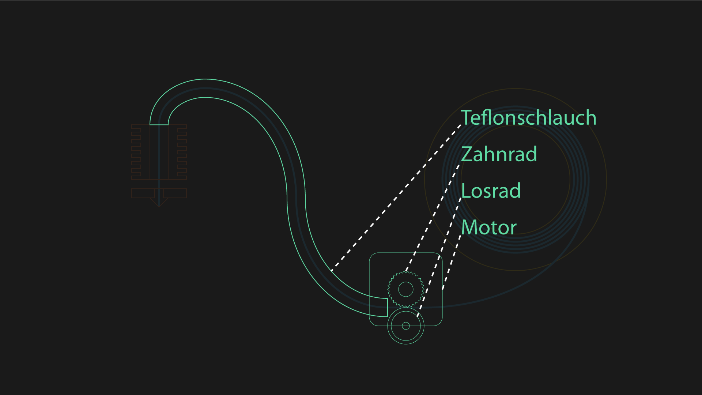
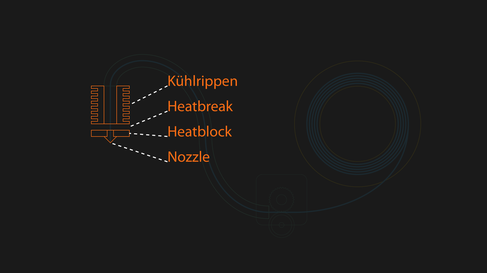
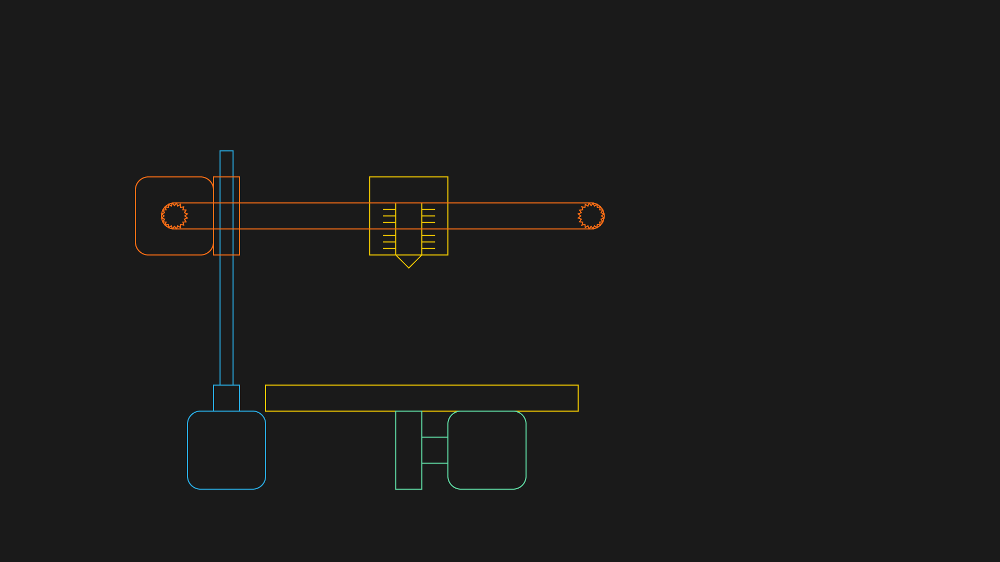
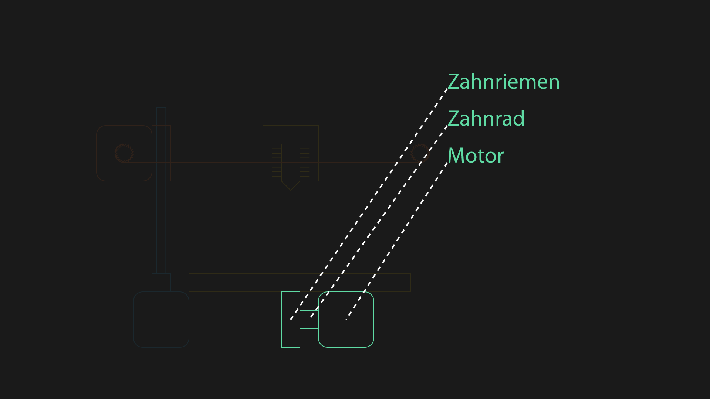
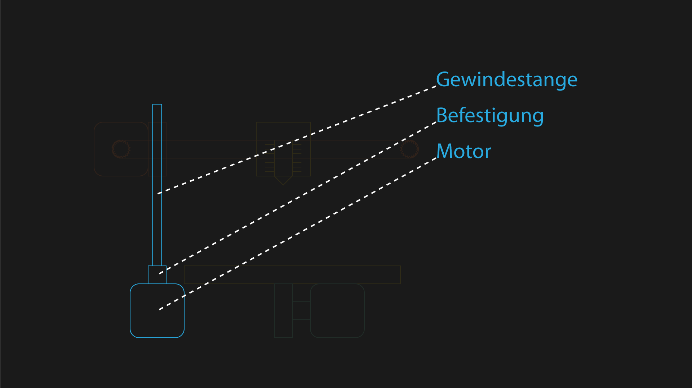
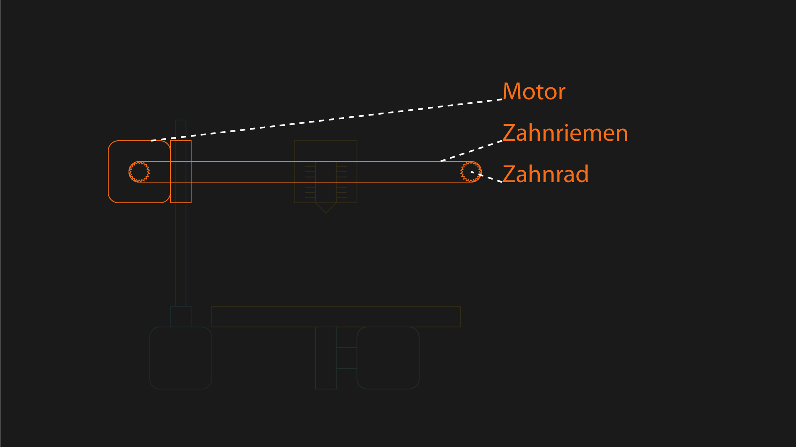

# 3D Druck

## Was ist eigentlich 3D-Druck?

3D-Druck ist ein additives Fertigungsverfahren

### Additive Fertigung

Material Schicht für Schicht auftragen.

### Konventionelle Fertigung

Sägen, Bohren, Fräßen, Gießen

## Seit wann gibt es 3D Drucker?

### Kurze Geschichte

* 1981 Erfindung Stereolithografie
* 1985 Das erste 3D-Konstruktionsprogramm
* 1986 Erste Patentanmeldung
* 1988 Erster kommerzieller 3D-Drucker

(Quelle [heise](https://www.heise.de/newsticker/meldung/Missing-Link-Der-3D-Drucker-oder-Die-Enttaeuschung-die-nicht-stattfand-4489590.html) [heise](https://www.heise.de/tr/artikel/3D-Drucker-fuer-das-Volk-279077.html) [wikipedia](https://de.wikipedia.org/wiki/RepRap))

### Anwendung und Kosten

* In der Industrie für **Rapid prototyping**
* Später [Rapid Manufactoring](https://de.wikipedia.org/wiki/Rapid_Manufacturing), [Rapid Tooling](https://de.wikipedia.org/wiki/Rapid_Tooling) etc.
* Kosten weit jenseits der 10K € Marke

(Quelle [heise.de 22.09.2019](https://www.heise.de/newsticker/meldung/Missing-Link-Der-3D-Drucker-oder-Die-Enttaeuschung-die-nicht-stattfand-4489590.html))
(Quelle Wikipedia 22.09.2019)

### Der 3D-Druck Hype

* 2005 Personal Fabricator (Fab@Home)
    * Cornell University, Konzept eines Druckers für unter 2000€
* 2006 RepRap open hardware Projekt
    * Adrian Bowyer, Konzept eines Druckers für unter 500€
* 2009 Patente für **FDM** laufen aus
    * Erste kommerzielle 3D-Drucker für unter 1000€
* 2019 Preise fallen, chinesische Hersteller steigen ein
    * Preise für qualitativ akzeptable Geräte sinken Richtung 200€
    * Verbreitung der 3D-Drucker nimmt zu
    * Immer mehr Heimanwender

(Quelle [heise](https://www.heise.de/newsticker/meldung/Missing-Link-Der-3D-Drucker-oder-Die-Enttaeuschung-die-nicht-stattfand-4489590.html) [heise](https://www.heise.de/tr/artikel/3D-Drucker-fuer-das-Volk-279077.html) [wikipedia](https://de.wikipedia.org/wiki/RepRap))

## 3D-Druck verfahren

* **SLA** [Stereolithografie](https://de.wikipedia.org/wiki/Stereolithografie)
* **SLS** [Selective Laser Sintering](https://de.wikipedia.org/wiki/Selektives_Lasersintern)
* **SLM** [Selective Laser Melting](https://de.wikipedia.org/wiki/Selektives_Laserschmelzen)
* **LOM** [Laminated Object Manufacturing](https://de.wikipedia.org/wiki/Laminated_Object_Manufacturing)
* **FDM** [Fused Deposition Modeling](https://de.wikipedia.org/wiki/Fused_Deposition_Modeling)

(Quelle [Wikipedia](https://de.wikipedia.org/wiki/3D-Druck) 22.09.2019)

### SLA (Stereo Lithografie)

* Ältestes additives Fertigungsverfahren

* Flüssiges Material wird mit Hilfe von UV laser ausgehärtet

* Anwendung:
    * Rapid prototyping
    * Medizin

* Materialien:
    * Flüssiger, lichtaushärtender Kunststoff (Photopolymer)

(Quelle [Wikipedia](https://de.wikipedia.org/wiki/Stereolithografie) 22.09.2019)
[video](https://www.youtube.com/watch?v=8a2xNaAkvLo)

### SLS (Selective Laser Sintering)

* Schichtweise aufgetragenes Pulver mit Laser gesintert/geschmolzen mit Einsatz von Bindemitteln zu fester Schicht verschmolzen.

* Anwendung:
    * Rapid prototyping
    * Rapid tooling

* Materialien:
    * Kunststoffpulver
    * Metallpulver

(Quelle [Wikipedia](https://de.wikipedia.org/wiki/Selektives_Lasersintern) 22.09.2019)
[video](https://www.youtube.com/watch?v=ruvRijM7f50) [video DMLS](https://www.youtube.com/watch?v=yiUUZxp7bLQ)

### SLM (Selective Laser Melting)

* Schichtweise aufgetragenes Pulver mit Laser gesintert/geschmolzen ohne Einsatz von Bindemitteln zu fester Schicht verschmolzen.

* Anwendung
    * Rapid prototyping
    * Rapid tooling

* Materialien:
    * Kunststoffpulver
    * Metallpulver

(Quelle [Wikipedia](https://de.wikipedia.org/wiki/Selektives_Laserschmelzen), 22.09.2019)

### LOM (Laminated Object Manufacturing)

* Folien werden schichtweise aufgetragen, verklebt und zugeschnitten.

* Anwendung:
    * Rapid prototyping

* Materialien:
    * Papierfolien
    * Kunststofffolien
    * Aluminiumfolien
    * Keramikfolien

(Quelle [Wikipedia](https://de.wikipedia.org/wiki/Laminated_Object_Manufacturing), 22.09.2019)
[video](https://www.youtube.com/watch?v=6C7bjzIW610)

### FDM (Fused Deposition Modeling)

* FDM ist markenrechtlich geschützt und wird daher auch als FFF (Fused Filament Fabrication) bezeichnet.

* Schichtweises Auftragen von geschmolzenem Filament aus Kunststoff durch heiße Düse.

* Anwendung:

* Materialien:
    * Kunststoffe (thermoplaste)
        * PLA (polylactide/polymilchsäure)
        * ABS (Acrylnitril-Butadien-Styrol-Copolymer)
        * PET(G) (Polyethylenterephthalat)
        * TPU (Thermoplastisches Polyurethane)

(Quelle [Wikipedia](https://de.wikipedia.org/wiki/Fused_Deposition_Modeling), [Wikipedia](https://de.wikipedia.org/wiki/Polyurethane), [all3dp](https://all3dp.com/de/1/3d-drucker-filament-vergleich-beste-arten/#section-standard-3d-drucker-filamente)  22.09.2019)

## Fused Deposition Modeling

(Quelle [Wikipedia](https://en.wikipedia.org/wiki/Bowden_extruder), 24.09.2019)

### Extruder

* Teflonschlauch
* Zahnrad
* Motor
* Losrad

* Bowden
    * Leicht zu tauschen
    * Weniger Masse am Druckkopf
        * Schnellere Bewegungen
        * Schnellere Druckgeschwindigkeit
        * Höhere Genauigkeit
    * Langer bowden tube
        * Reibung
        * Dehnung/Stauchung des Filaments
* Direct

### Hotend

* Pushfit Schnellkupplung
* Kühlrippen
* Heatbreak
* Heatblock
* Nozzle

(Quelle [threedom.de](https://threedom.de/3d-drucker-hotend), 24.09.2019)

#### Nozzle

* Wird nach der Größe der Öffnung benannt
* Meist 0.4mm Durchmesser
* Gibt Schichtdicke und Wandbreite vor
    * 0.4mm ermöglicht 0.1-0.3mm Schichtdicke
    * Wände sollten immer ein Vielfaches des Nozzledurchmessers sein

(Quelle [prusa](https://blog.prusaprinters.org/everything-about-nozzles-with-a-different-diameter/), 29.09.2019)

### Mechanik

* Nozzle wird meist an zwei Achsen bewegt
    * X,Y (Ultimaker)
    * X,Z (Prusa)

* Das Druckbett wird über die dritte Achse bewegt

(Quelle ?)

### Druckbett

* Haftung der ersten Schicht am Wichtigsten
* Druckergebnis hängt stark von Qualität der ersten Schicht ab

(Quelle [scoobe3d](https://scoobe3d.com/3d-druck-basics-in-9-schritten-zur-perfekten-ersten-schicht/), 29.09.2019)

#### Typen

* Beheizt
* Unbeheizt

(Quelle [all3dp](https://all3dp.com/de/1/bester-3d-drucker-test-vergleich-kaufberatung/), 3.10.2019)

#### Oberflächen

* Glas
    * Viele Materialien nur beheizt
    * Glastemperatur

* Kunststoffe
    * Oft mit Struktur Oberfläche

* Malerkrepp
    * Oft zum Verbessern der Haftung verwendet

(Quelle [filamentworld](https://www.filamentworld.de/die-richtige-druckunterlage-fuer-3d-drucker/), 3.10.2019)

### Filament

#### Physikalische Eigenschaften
* Unterscheiden sich in physikalischen Eigenschaften
    * Festigkeit
    * Flexibilität
    * Haltbarkeit
    * Schrumpf und Verzug (Warping)
    * Löslich (Stützstrukturen)

#### Verarbeitungseigenschaften

* Verschiedene Verarbeitungseigenschaften
    * Durcktemperatur
    * Glastemperatur (Glass transition temperature)
        * Temperatur bei der das material von hart zu gummiartig/zähflüssig übergeht
        * Ideale Temperatur für ein Glasdruckbett
        * Druckbetttemperatur
        * Material verformt sich ab dieser Temperatur

(Quelle: [Wikipedia](https://de.wikipedia.org/wiki/Glas%C3%BCbergangstemperatur), [all3dp.com](https://all3dp.com/de/1/3d-drucker-filament-vergleich-beste-arten/#section-standard-3d-drucker-filamente), 22.09.2019)
#### PLA

* Ist das am häufigsten verwendete Filemant.
    * Biokompatibel
    * Anwendung in bio Plastiktüten, etc.

* Festes, sprödes Material, bricht leicht.

(Quelle [Wikipedia](https://de.wikipedia.org/wiki/Polylactide), [all3dp.com](https://all3dp.com/de/1/3d-drucker-filament-vergleich-beste-arten/#section-standard-3d-drucker-filamente), 22.09.2019))

##### Eigenschaften

* Schwierigkeit:
    * Gering

* Drucktemperatur
    * 180-230 °C

* Druckbett-Temperatur
    * 20 - 60 °C

* Schrumpf und Verzug
    * Gering

* Haltbarkeit
    * Durchschnittlich

* Glastemperatur
    * 45-65 °C

* Löslich
    * Nein

(Quelle [Wikipedia](https://de.wikipedia.org/wiki/Polylactide), [all3dp.com](https://all3dp.com/de/1/3d-drucker-filament-vergleich-beste-arten/#section-standard-3d-drucker-filamente), 22.09.2019)

#### ABS

* Robuster Kunststoff
    * Eignet sich zum Beschichten mit Metallen und anderen Kunststoffen
    * LEGO-Steine, Playmobil, Motorradhelme

* Festes, haltbares und temperaturbeständiges Material.

(Quelle [Wikipedia](https://de.wikipedia.org/wiki/Acrylnitril-Butadien-Styrol-Copolymer), [all3dp.com](https://all3dp.com/de/1/3d-drucker-filament-vergleich-beste-arten/#section-standard-3d-drucker-filamente), 22.09.2019))

##### Eigenschaften

* Schwierigkeit:
    * Hoch

* Drucktemperatur
    * 210-250 °C

* Druckbett-Temperatur
    * 80 - 110 °C

* Schrumpf und Verzug
    * Stark

* Haltbarkeit
    * Hoch

* Glastemperatur
    * 95 - 110 °C

* Löslich
    * Ester, Ketonen und Aceton

(Quelle [Wikipedia](https://de.wikipedia.org/wiki/Acrylnitril-Butadien-Styrol-Copolymer), [all3dp.com](https://all3dp.com/de/1/3d-drucker-filament-vergleich-beste-arten/#section-standard-3d-drucker-filamente), [golem.de](https://www.golem.de/news/3doodler-im-test-mit-geduld-und-drucker-1404-105440-3.html) 22.09.2019))

#### PETG

* Lebensmittelsicherheit fraglich (hormonaktive Eigenschaften?)
    * Anwendung in PET Flaschen
    * Teil-biobasiert erhältlich

* Festes, flexibles, haltbares Material.
* Extrem hygroskopisch und klebrig (Stützstrukturen).

(Quelle [Wikipedia](https://de.wikipedia.org/wiki/Polyethylenterephthalat), [all3dp.com](https://all3dp.com/de/1/3d-drucker-filament-vergleich-beste-arten/#section-standard-3d-drucker-filamente), 22.09.2019))

##### Eigenschaften

* Schwierigkeit:
    * Gering

* Drucktemperatur
    * 220 - 250 °C

* Druckbett-Temperatur
    * 50 - 75 °C

* Schrumpf und Verzug
    * Gering

* Haltbarkeit
    * Hoch

* Glastemperatur
    * 70 °C

* Löslich
    * Nein

(Quelle [Wikipedia](https://de.wikipedia.org/wiki/Polyethylenterephthalat), [all3dp.com](https://all3dp.com/de/1/3d-drucker-filament-vergleich-beste-arten/#section-standard-3d-drucker-filamente), 22.09.2019))

#### TPU

* Eine Form der Polyurethane
    * Anwendung(PU): Schaumstoffe, Lacke, Beschichtungen, Klebstoffe, Vergussmassen
    * TPU hat fast gummiartige Eigenschaften.

* Sehr flexibles, elastisches material
* Wegen der Materialeigenschaften schwer zu drucken.

(Quelle [Wikipedia](https://de.wikipedia.org/wiki/Polyurethane), [all3dp.com](https://all3dp.com/de/1/3d-drucker-filament-vergleich-beste-arten/#section-standard-3d-drucker-filamente), 22.09.2019))

##### Eigenschaften

* Schwierigkeit:
    * Mittel

* Drucktemperatur
    * 210 - 230 °C

* Druckbett-Temperatur
    * 30 - 60 °C

* Schrumpf und Verzug
    * Gering

* Haltbarkeit
    * Sehr hoch

* Glastemperatur
    * -223 °C

* Löslich
    * Nein

(Quelle [covestro](https://solutions.covestro.com/en/highlights/articles/theme/product-technology/mechanical-properties-tpu), [Wikipedia](https://de.wikipedia.org/wiki/Polyurethane), [all3dp.com](https://all3dp.com/de/1/3d-drucker-filament-vergleich-beste-arten/#section-standard-3d-drucker-filamente), 22.09.2019))
